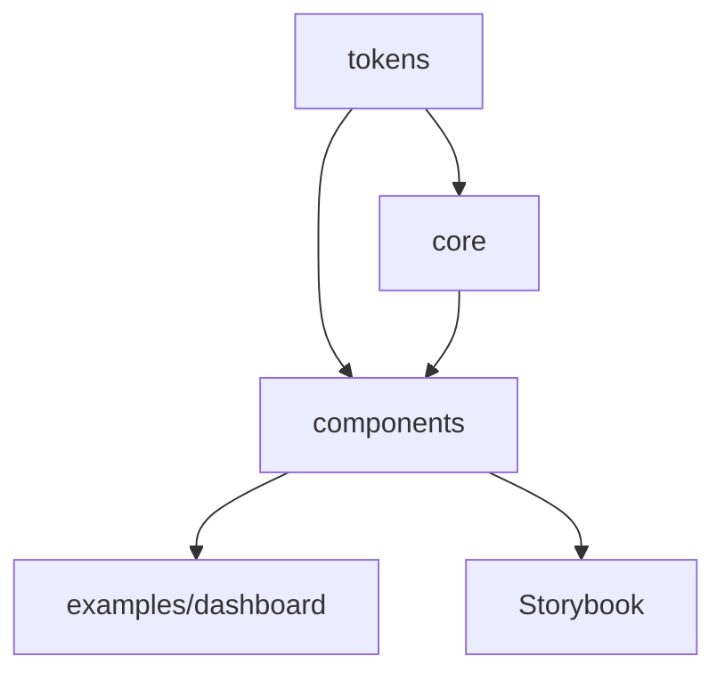

# Developer Guide

Welcome to the Prism Design System development guide! This document provides everything you need to know to work effectively with the codebase.

## 🏗️ Architecture Overview

### Monorepo Structure

```
prism-design-system/
├── packages/
│   ├── tokens/              # Design tokens (JSON → CSS/TS)
│   ├── core/               # Primitives & utilities
│   └── components/         # Complete component library
├── examples/
│   └── dashboard/          # Demo application
├── .storybook/            # Documentation config
├── docs/                  # Built documentation
└── .github/workflows/     # CI/CD automation
```

### Package Dependencies



## 🚀 Quick Start

### Prerequisites

- **Node.js**: 18.0.0 or higher
- **pnpm**: 8.0.0 or higher (required for workspace management)

### Initial Setup

```bash
# Clone and install
git clone https://github.com/your-org/prism-design-system.git
cd prism-design-system
pnpm install

# Generate design tokens
pnpm generate:tokens

# Start development environment
pnpm dev
```

### Development Commands

```bash
# Development
pnpm dev                    # Start Storybook (http://localhost:6006)
pnpm dev --filter dashboard # Start dashboard example

# Building
pnpm build                  # Build all packages
pnpm build:storybook       # Build Storybook for deployment

# Testing
pnpm test                  # Run all tests
pnpm test:watch           # Watch mode
pnpm test:coverage        # Generate coverage report

# Code Quality
pnpm lint                 # ESLint check
pnpm lint:fix            # Auto-fix linting issues
pnpm typecheck           # TypeScript type checking
pnpm format              # Prettier formatting
```

## 📦 Package Development

### Working with @prism/tokens

Design tokens are the foundation - modify JSON files and regenerate:

```bash
# Edit tokens in packages/tokens/tokens/*.json
# Then regenerate CSS and TypeScript exports
cd packages/tokens
pnpm generate-css

# Verify outputs
ls dist/
# css/variables.css  js/index.js  types/index.d.ts
```

**Token Structure:**

```json
{
  "color": {
    "primary": {
      "50": { "value": "#f0f9ff" },
      "500": { "value": "#3b82f6" },
      "900": { "value": "#1e3a8a" }
    }
  }
}
```

### Working with @prism/core

Core primitives provide the foundation for all components:

```typescript
// Add new primitive to packages/core/src/
export const NewPrimitive = ({ children, ...props }) => {
  return <Box {...props}>{children}</Box>
}

// Export from packages/core/src/index.ts
export { NewPrimitive } from './NewPrimitive'
```

**Key Patterns:**

- Use `React.forwardRef` for DOM elements
- Implement polymorphic `as` prop where appropriate
- Consume design tokens via CSS variables
- Include comprehensive TypeScript types

### Working with @prism/components

Component development follows strict patterns:

```bash
# Create new component
mkdir packages/components/src/NewComponent
cd packages/components/src/NewComponent

# Required files:
touch NewComponent.tsx           # Main component
touch NewComponent.test.tsx      # Jest + RTL tests
touch NewComponent.stories.tsx   # Storybook stories
touch types.ts                   # TypeScript interfaces
touch index.ts                   # Clean exports
```

**Component Template:**

```typescript
// NewComponent.tsx
import React from 'react'
import { Box } from '@prism/core'
import { NewComponentProps } from './types'

export const NewComponent = React.forwardRef<
  HTMLDivElement,
  NewComponentProps
>(({ children, variant = 'default', ...props }, ref) => {
  return (
    <Box
      ref={ref}
      data-testid="new-component"
      sx={{
        // Use design tokens
        padding: 'var(--prism-spacing-md)',
        borderRadius: 'var(--prism-radius-md)',
        // Variant styles
        ...(variant === 'primary' && {
          backgroundColor: 'var(--prism-colors-primary-500)',
          color: 'var(--prism-colors-primary-50)'
        })
      }}
      {...props}
    >
      {children}
    </Box>
  )
})

NewComponent.displayName = 'NewComponent'
```

## 🧪 Testing Strategy

### Test Types

1. **Unit Tests**: Component behavior and props
2. **Integration Tests**: Component interactions
3. **Accessibility Tests**: WCAG compliance via jest-axe
4. **Visual Tests**: Storybook + Chromatic

### Testing Patterns

```typescript
// NewComponent.test.tsx
import { render, screen } from '@testing-library/react'
import { axe } from 'jest-axe'
import { NewComponent } from './NewComponent'

describe('NewComponent', () => {
  it('renders with correct text', () => {
    render(<NewComponent>Test content</NewComponent>)
    expect(screen.getByText('Test content')).toBeInTheDocument()
  })

  it('supports variant prop', () => {
    render(<NewComponent variant="primary">Test</NewComponent>)
    const element = screen.getByTestId('new-component')
    expect(element).toHaveStyle({
      backgroundColor: 'var(--prism-colors-primary-500)'
    })
  })

  it('has no accessibility violations', async () => {
    const { container } = render(<NewComponent>Accessible content</NewComponent>)
    const results = await axe(container)
    expect(results).toHaveNoViolations()
  })
})
```

### Coverage Requirements

- **Minimum 90% code coverage**
- **All public APIs tested**
- **Accessibility compliance verified**
- **Error states handled**

## 📚 Documentation

### Storybook Stories

Every component needs comprehensive Storybook documentation:

```typescript
// NewComponent.stories.tsx
import type { Meta, StoryObj } from '@storybook/react';
import { NewComponent } from './NewComponent';

const meta: Meta<typeof NewComponent> = {
  title: 'Components/NewComponent',
  component: NewComponent,
  parameters: {
    docs: {
      description: {
        component: 'NewComponent provides...',
      },
    },
  },
  argTypes: {
    variant: {
      control: 'select',
      options: ['default', 'primary'],
      description: 'Visual variant of the component',
    },
  },
};

export default meta;
type Story = StoryObj<typeof meta>;

export const Default: Story = {
  args: {
    children: 'Default NewComponent',
  },
};

export const Primary: Story = {
  args: {
    variant: 'primary',
    children: 'Primary NewComponent',
  },
};

// Accessibility story
export const AccessibilityDemo: Story = {
  args: {
    children: 'Accessible component with proper ARIA',
  },
  parameters: {
    docs: {
      description: {
        story: 'This story demonstrates accessibility features...',
      },
    },
  },
};
```

### Documentation Standards

- **Component Description**: What it does and when to use it
- **Props Documentation**: All props with types and descriptions
- **Examples**: Common usage patterns
- **Accessibility Notes**: WCAG compliance details
- **Design Tokens**: Which tokens are used

## 🎨 Design Token Workflow

### Adding New Tokens

1. **Define in JSON**:

```json
// packages/tokens/tokens/colors.json
{
  "color": {
    "semantic": {
      "info": {
        "50": { "value": "#eff6ff" },
        "500": { "value": "#3b82f6" },
        "900": { "value": "#1e3a8a" }
      }
    }
  }
}
```

2. **Generate CSS**:

```bash
pnpm --filter @prism/tokens generate-css
```

3. **Use in Components**:

```css
.info-banner {
  background-color: var(--prism-colors-semantic-info-50);
  color: var(--prism-colors-semantic-info-900);
  border: 1px solid var(--prism-colors-semantic-info-500);
}
```

### Token Naming Convention

- **Structure**: `category-subcategory-variant-scale`
- **Examples**:
  - `colors-primary-500`
  - `spacing-md`
  - `typography-fontSize-lg`
  - `radius-xl`

## 🔄 Release Process

### Version Management with Changesets

1. **Make Changes**: Develop features/fixes in feature branches

2. **Create Changeset**:

```bash
pnpm changeset
# Select affected packages
# Choose change type (patch/minor/major)
# Write description
```

3. **Commit & Push**:

```bash
git add .
git commit -m "feat(components): add DatePicker component"
git push origin feature/date-picker
```

4. **Release**: Changesets automatically creates release PRs

### Change Types

- **patch**: Bug fixes, documentation updates
- **minor**: New features, non-breaking changes
- **major**: Breaking changes, API modifications

### Release Automation

The CI/CD pipeline handles:

- ✅ Automated testing
- ✅ Build verification
- ✅ Version bumping
- ✅ NPM publishing
- ✅ Documentation deployment
- ✅ Git tagging

## 🌍 Internationalization & RTL

### RTL Support Implementation

```typescript
// Use logical properties in components
const componentStyles = {
  marginInlineStart: 'var(--prism-spacing-md)',
  paddingInlineEnd: 'var(--prism-spacing-sm)',
  textAlign: 'var(--prism-text-align-start)', // Responds to dir="rtl"
};
```

### Theme Direction

```typescript
// Theme context includes direction
const theme = useTheme()
const isRTL = theme.direction === 'rtl'

// Conditional styling based on direction
<Box sx={{
  transform: isRTL ? 'scaleX(-1)' : 'none'
}}>
```

## 🔧 Troubleshooting

### Common Issues

**TypeScript Errors in Development**:

```bash
# Clear cache and reinstall
rm -rf node_modules packages/*/node_modules
pnpm install
pnpm generate:tokens
```

**Storybook Build Failures**:

```bash
# Ensure packages are built first
pnpm build
pnpm build:storybook
```

**Jest Test Failures**:

```bash
# Update snapshots if needed
pnpm test -- --updateSnapshot

# Run specific test
pnpm test -- NewComponent.test.tsx
```

### Performance Debugging

```bash
# Bundle analysis
pnpm --filter @prism/components build --analyze

# Test runtime performance
pnpm test:performance
```

## 🚀 Deployment

### Automatic Deployment

- **Storybook**: Deploys to Vercel on every push to main
- **NPM Packages**: Published via Changesets on release
- **Examples**: Dashboard deployed alongside Storybook

### Manual Deployment

```bash
# Build everything
pnpm build
pnpm build:storybook

# Deploy to Vercel
vercel --prod
```

## 🤝 Contributing Workflow

1. **Fork & Clone**: Create your fork
2. **Branch**: `git checkout -b feature/amazing-feature`
3. **Develop**: Make changes with tests
4. **Test**: `pnpm test && pnpm lint`
5. **Changeset**: `pnpm changeset`
6. **PR**: Open with clear description

### Code Review Checklist

- [ ] Tests pass and coverage maintained
- [ ] Accessibility requirements met
- [ ] Design tokens used consistently
- [ ] Documentation updated
- [ ] Changeset created
- [ ] No breaking changes (or properly documented)

---

Happy coding! 🎉 If you have questions, check our [Contributing Guide](./CONTRIBUTING.md) or open a discussion.
